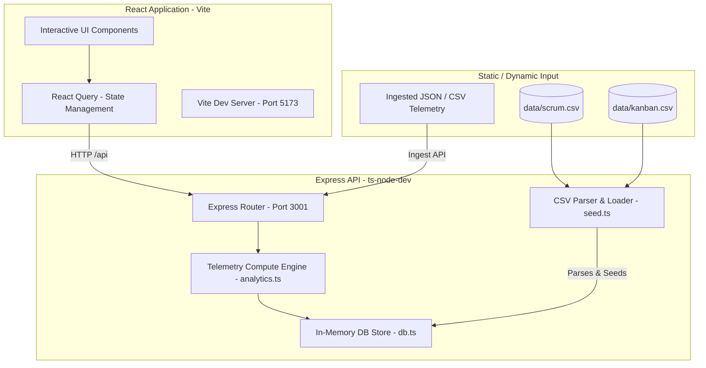

# TokenTrek Project Documentation & Knowledge Base

TokenTrek is a modern developer productivity, cost optimization, and leaderboard platform. It aggregates telemetry from software development tools (such as Git commits, Scrum/Kanban board metrics, and AI assistant prompt usage) to provide deep intelligence into engineering operations, AI tool efficiency, and organizational productivity.

---

## 1. System Architecture

TokenTrek uses a decoupled client-server architecture built on modern TypeScript/JavaScript tools:



- **Frontend**: A single-page React app bundled with Vite. It features a responsive layout using custom UI components, Vanilla CSS styling tokens, and Recharts for interactive visualization. It relies on React Query (`@tanstack/react-query`) for API fetching, caching, and state synchronization.
- **Backend**: An Express.js application running on Node.js. It handles API requests, parses telemetry, and exposes metrics via REST endpoints.
- **Data Store**: An in-memory database (`backend/src/db.ts`) containing tables for developers, teams, AI platforms, activities, and daily usage statistics.
- **Ingestion Pipeline**: The backend runs as a reactive pipeline. By default, it starts in a clean, empty state. Real-time data is ingested dynamically from local static files (CSV parser for git metrics) or via user uploads in the Upload Center.

---

## 2. In-Memory Database Schema (`db.ts`)

The in-memory database store maintains the following relations:

```typescript
export interface Store {
  platforms: Platform[];         // AI tools (e.g., Claude, GPT-4o, Cursor)
  developers: Developer[];       // Software engineers tracked by the system
  teams: Team[];                 // Engineering teams (e.g., Platform Team, Backend Team)
  daily_stats: DailyStat[];      // Time-series records of usage, requests, and costs
  model_costs: ModelCost[];      // Aggregate cost metrics grouped by AI model
  prompts: Prompt[];             // Logged AI assistant prompts
  developer_scores: DevScore[];  // Evaluated productivity and efficiency scores
  team_costs: TeamCost[];        // Spend breakdowns per team
  live_activity: LiveActivity[];  // Real-time action log
  waste_items: WasteItem[];      // Inefficient usage detections (N+1 queries, duplicate prompts)
  insights: Insight[];           // AI-generated suggestions and action items
}
```

---

## 3. Frontend Features & Available Pages

The React frontend includes 16 specialized modules accessible from the main navigation sidebar:

### 📊 Core Analytics
1. **Overview**: The main command center displaying global metrics (Active Users, Cost Saved, Total Requests, Total Tokens, ROI) and interactive charts for Cost vs Budget, Usage Trends, and Live Activity logs.
2. **Cost Center**: In-depth cost analytics including cost projections, platform budget utilization, and historical spending comparisons.
3. **Model Analytics**: Detailed comparison of AI model performance, showing cost-efficiency metrics, latency distributions, and token ratios (Prompt vs Completion) for models like Claude 3.5 Sonnet, GPT-4o, and Gemini.
4. **Prompt Analytics**: Metrics on prompt engineering behavior, categorizing requests into Code Generation, Test Suites, Debugging, etc., alongside average token size and response success rates.

### 🏆 Team & Gamification
5. **AI League**: Leaderboard tracking individual developer productivity scores. It ranks engineers using metrics like code acceptance rates, model optimization, and token efficiency.
6. **Teams**: Analytics aggregated at the department/team level. It shows headcounts, total spend, adoption rates, and budget health.
7. **Team Battle Board**: A head-to-head comparison page showcasing comparative radar diagrams and metric breakdowns across teams.
8. **Developer XP**: A gamified experience tracking page displaying developers' experience levels (XP), completed tasks, and badge achievements.

### 🔍 Optimization & Audits
9. **AI Waste Detector**: Scans prompts and activities to identify patterns of token waste. Highlights duplicated prompt requests, overly broad queries, and repetitive context injections.
10. **Replay Center**: Allows administrators to review developer prompts and corresponding model answers side-by-side to understand prompt effectiveness.
11. **Prompt Marketplace**: A centralized library for verified prompt templates, categorized by engineering, testing, DevOps, and database development.

### ⚙️ System Controls
12. **Git Stats**: Integrates telemetry directly from Git version control (commits, churn, lines added/removed, code complexity metrics) extracted from Scrum and Kanban CSV logs.
13. **Upload Center**: Ingestion portal where teams can upload JSON or CSV log files to dynamically populate the system's database.
14. **Reports**: Scheduled configuration summaries (Executive summaries, security audits, performance reviews) prepared for export.
15. **Settings**: Controls for managing API connections, webhook integrations, model pricing matrices, and token alert thresholds.

---

## 4. Backend REST API Endpoints

The API is separated into modular routers:

### 📈 Overview Router (`/api/overview`)
*   `GET /stats`: Returns total requests, cost, tokens, and active developer count.
*   `GET /usage-trend`: Delivers daily time-series records of token usage.
*   `GET /platform-costs`: Returns cost breakdown by AI platforms.
*   `GET /model-costs`: Returns cost breakdown by LLM model names.
*   `GET /top-prompts`: Returns the top 5 most utilized prompt templates.
*   `GET /developer-scores`: Returns active developer scores.
*   `GET /team-costs`: Returns team cost stats.
*   `GET /live-activity`: Returns real-time activity log entries.
*   `GET /waste-items`: Returns detected token waste items.
*   `GET /insights`: Returns automated, cost-saving recommendations.

### 🧠 Analytics Router (`/api/analytics`)
*   `GET /config`: Delivers visual configuration tokens (colors, icons, charts settings).
*   `GET /totals`, `/daily-usage`, `/platform-usage`: Internal math values.
*   `GET /marketplace`: Returns community prompt templates.
*   `GET /replay`: Returns interactive session logs.
*   `GET /reports`: Delivers audit reports.

### 🏅 League Router (`/api/league`)
*   `GET /developer-leaderboard`: Generates ranks and scores for active developers.
*   `GET /team-leaderboard`: Generates stats and score breakdowns for teams.
*   `GET /champions`: Identifies top weekly and monthly champions in adoption and savings.

### 📂 Data Ingestion Router (`/api/data`)
*   `POST /upload`: Standard JSON payload parser to import stats.
*   `POST /upload-csv`: Parses CSV data to ingest telemetry.

---

## 5. Development Guide & Technical Rules

- **State Sync**: All pages fetch their core telemetry from the backend. They must handle empty states gracefully (e.g., return `[]` or show `<EmptyState />`).
- **Styles**: Use standard Vanilla CSS with custom utility variables defined in `index.css`. Avoid hardcoding color codes inside individual page layouts; pull colors from `uiConfig` (`/api/analytics/config`) to maintain visual consistency.
- **CSV Processing**: Git stats are loaded using a fast CSV parser parsing standard header schemas:
  - Scrum format: `Task ID,Developer,Status,Hours,Commits,Lines Changed`
  - Kanban format: `Card ID,Developer,Column,Priority,Story Points`
